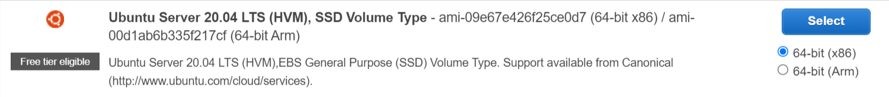
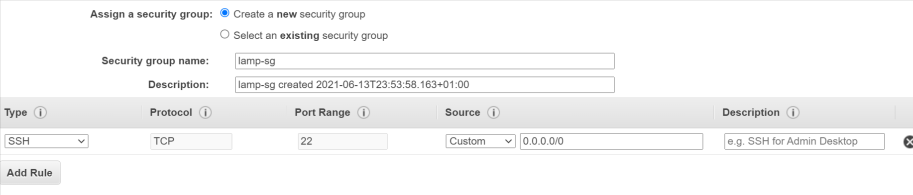
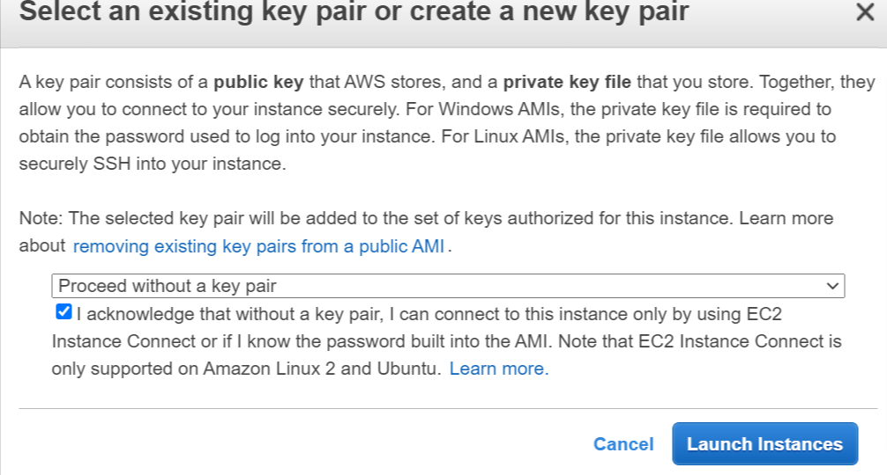
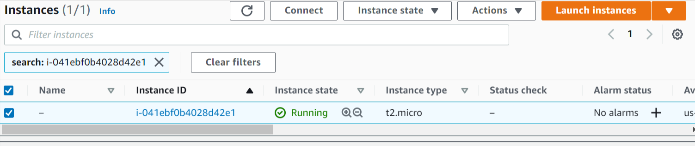
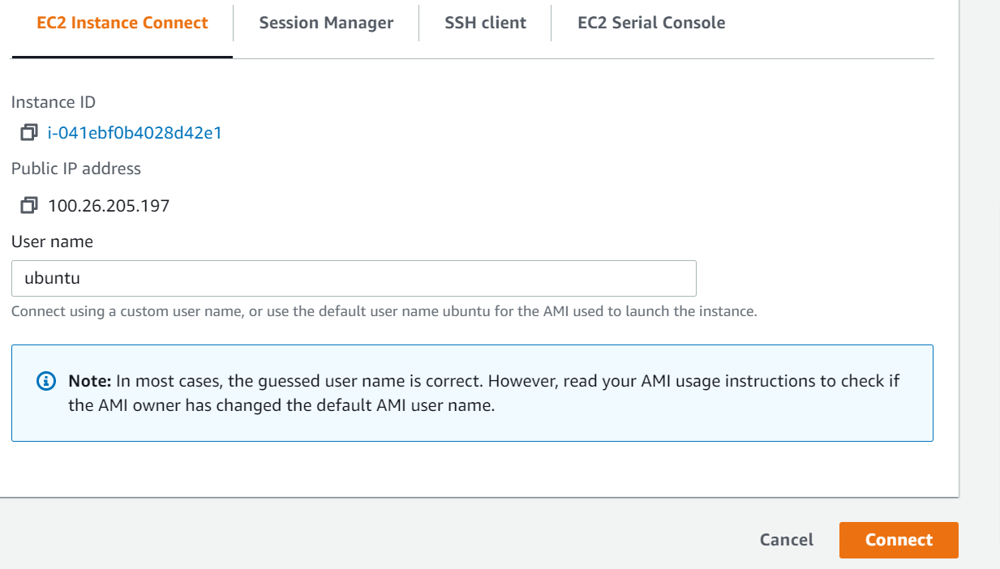
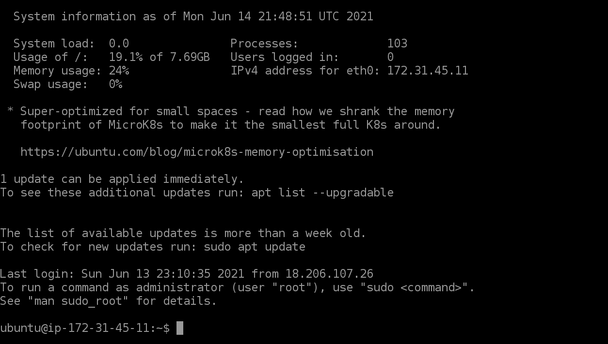
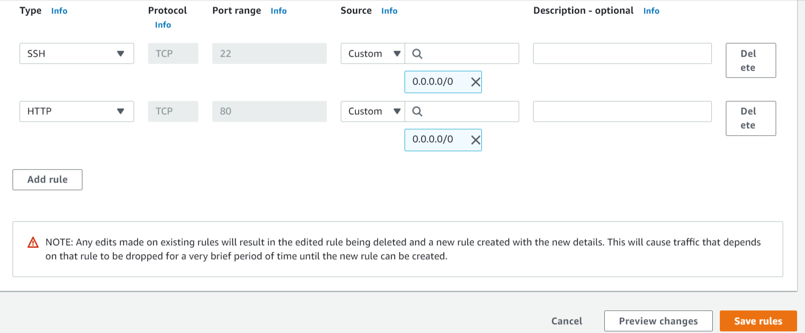
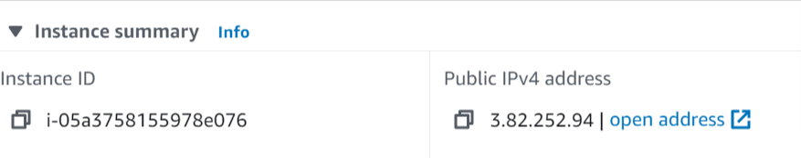
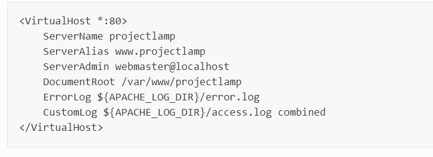
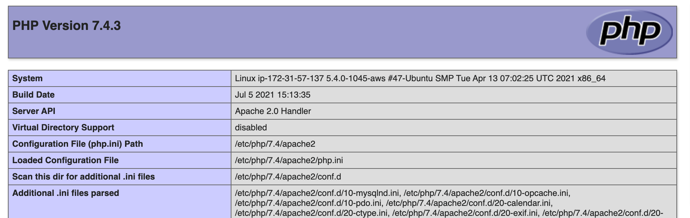

# DEPLOY LAMP STACK APPLICATION ON AWS
___
 > Step 1

- Launch an EC2 instance on AWS.

- Choose instance type

- Add storage and tags
- Configure security groups

- Review and Launch
- Select / Create a new Key pair but for this, i proceeded without a keypair.

- Launch instance

> Step 2
- Install Apache2 using Ubuntu’s package manager ‘apt’:

- Check running instance and click on CONNECT

- We are connected to the EC2 machine. This is where we would install our apache2 web server.

- To update the list of packages in package manager run 
 __sudo__ apt update \
#run apache2 package installation \
$ __sudo__ apt install apache2 

- Learn why we use sudo [here](https://www.beyondtrust.com/blog/entry/unix-linux-privileged-management-should-you-sudo#:~:text=If%20users%20want%20a%20root,privileges%20to%20perform%20such%20tasks.)

- Verify apache2 is running  
 __sudo__ systemctl status apache2  

 - To recieve traffic into the webserver, open port 80 on our EC2 machine.  
 Go to Security Groups > Inbound Rules > Edit Inbound Rules > Add rule > Save Rule

 -  

 - Check to access locahost from the ubuntu shell  
 curl http://localhost:80  
 Test the Apache2 server  by opening any browser and type http://your-ec2-public-ip-addess:80  
 You can get the public IP address like this  
 curl -s http://169.254.169.254/latest/meta-data/public-ipv4 or  
   
 The Apache page shows up which indicates that Apache2 sever is installed successfully.  

> Step 3
- Install MySQL Server  
__sudo__ apt install mysql-server  

- Run a security script that comes pre-installed with MySQL  
__sudo__ mysql_secure_installation  
You can enable VALIDATE PASSWORD PLUGIN by pressing Y or press other keys to continue without enabling it.  
- Login to MySQL console  
__sudo__ mysql. Run __exit__ to exit out of the mysql console.

> Step 4
-   Install PHP
-   In addition to the php package, you’ll need php-mysql, a PHP module that allows PHP to communicate with MySQL-based databases. You’ll also need libapache2-mod-php to enable Apache to handle PHP files.
- __sudo__ apt install php libapache2-mod-php php-mysql  
- Confirm PHP version by running __php -v__  
 Linux (Ubuntu), 
 Apache HTTP Server,
 MySQL and 
 PHP has been successfully installed.  

 - To test your setup with a PHP script, set up a proper [Apache Virtual Host](https://httpd.apache.org/docs/2.4/vhosts/) to hold your website’s files and folders.

 >Step 5
 - Create Virtual Host for your Website using Apache.  
 Apache on Ubuntu 20.04 has one server block enabled by default that is configured to serve documents from the __/var/www/html__ directory. We will leave this configuration as is and will add our own directory  next to the default one.  

 - __sudo__ mkdir /var/www/lampproject  
 - Assign ownership of the directory with the $USER environment variable, which will reference your current system user:
 - __sudo__ chown -R $USER:$USER /var/www/lampproject

 - Create and open a new configuration file in Apache’s sites-available directory.
 - sudo vi /etc/apache2/sites-available/lampproject.conf.  
 - Paste the following in the blank file  
 - 
 - Note: change projectlamp to lampproject

- To save and close the file, simply follow the steps below:
- Hit the esc button on the keyboard
Type :  
- Type wq. w for write and q for quit. Hit ENTER to save the file.
- With this VirtualHost configuration, we’re telling Apache to serve lampproject using /var/www/lampproject as its web root directory.

- To show the new file in the sites-available directory 
- __sudo__ ls /etc/apache2/sites-available

- Use __a2ensite__ command to enable the new virtual host.
- __sudo__ a2ensite lampproject

- Disable the default website that comes installed with Apache. This is required if you’re not using a custom domain name, because in this case Apache’s default configuration would overwrite your virtual host.

- With this VirtualHost configuration, we’re telling Apache to serve projectlamp using /var/www/projectlampl as its web root directory.

- You might want to disable the default website that comes installed with Apache. This is required if you’re not using a custom domain name, because in this case Apache’s default configuration would overwrite your virtual host. To disable Apache’s default website use a2dissite command , type:

- __sudo__ a2dissite 000-default

- To make sure your configuration file doesn’t contain syntax errors, run:
- sudo apache2ctl configtest
-  Reload Apache with 
- sudo systemctl reload apache2

- Create an index.html file in the web root /var/www/lampproject
- sudo echo 'Hello LAMP from hostname' $(curl -s http://169.254.169.254/latest/meta-data/public-hostname) 'with public IP' $(curl -s http://169.254.169.254/latest/meta-data/public-ipv4) > /var/www/lampproject/index.html

- Now go to your browser and try to open your website URL using IP address:

- http://{your-Public-IP-Address}:80

> Step 6
- Enable PHP on the website  

- With the default DirectoryIndex settings on Apache, a file named index.html will always take precedence over an index.php file. This is useful for setting up maintenance pages in PHP applications, by creating a temporary index.html file containing an informative message to visitors. Because this page will take precedence over the index.php page, it will then become the landing page for the application. Once maintenance is over, the index.html is renamed or removed from the document root, bringing back the regular application page.  

- To change this behaviour, edit the /etc/apache2/mods-enabled/dir.conf file and change the order in which the index.php file is listed within the DirectoryIndex directive.  

- __sudo__ vim /etc/apache2/mods-enabled/dir.conf  
After saving, run __sudo__ systemctl reload apache2  

- Create a PHP test script to confirm that Apache is able to handle and process requests for PHP files.  

- Create a new file named index.php inside your custom web root folder:

- vim /var/www/lampproject/index.php  
- Add the PHP code in the bracket to the black file and save   
[ <?php
phpinfo(); ]  

- Save and close the file, refresh the page and you will see a page similar to this. 

- 

- After checking the relevant information about your PHP server through that page, it’s best to remove the file you created as it contains sensitive information about your PHP environment -and your Ubuntu server. You can use rm to do so:

- __sudo__ rm /var/www/projectlamp/index.php

- All done!!

 

 

